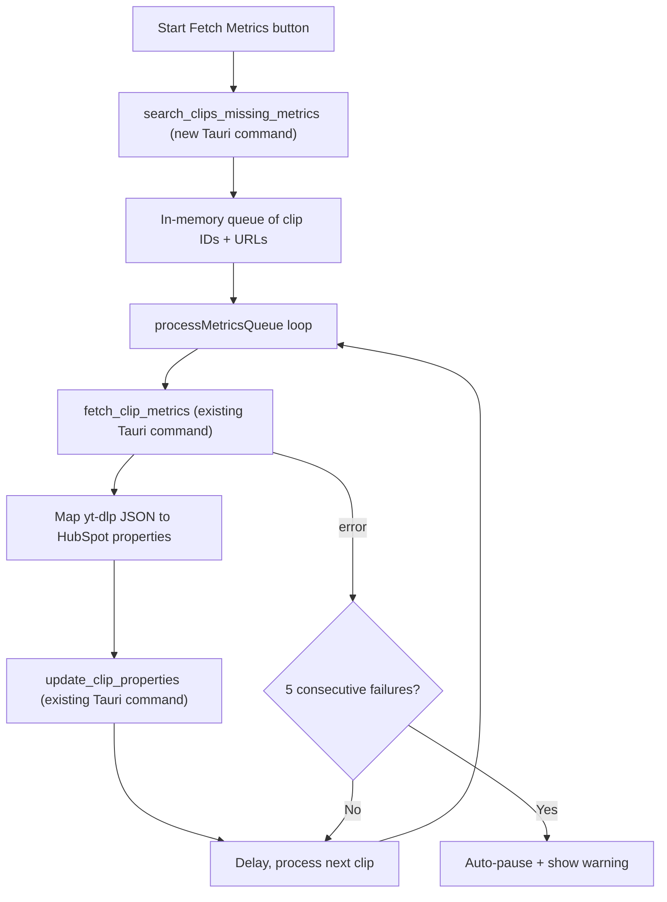

# In-App Social Metrics Backfill (Tag Clips Page)

## Context

Social media metrics (`social_media_caption`, `likes`, `comments`, `plays`, `shares`, `posted_date`, `social_media_tags`) are fetched via `yt-dlp --dump-json` only at clip creation time. Existing clips that predate this feature, or where the fetch failed, are missing this data.

Instead of building an external server, add a background metrics fetch queue directly to the **Tag Clips page** -- leveraging the existing `fetch_clip_metrics` and `update_clip_properties` Tauri commands that already work.

## Why This Approach Wins

- Zero new infrastructure -- no server, no Docker, no API costs
- Browser cookies available (critical for Instagram)
- Every employee with the app open contributes to the backfill
- Built-in manual pause + auto-pause on repeated failures
- Reuses the exact same `fetch_clip_metrics` + property mapping logic from [GeneralSearchTab.tsx](src/components/GeneralSearchTab.tsx) (lines 510-540)

## Architecture




## Implementation

### 1. New Tauri Command: `search_clips_missing_metrics`

Add to [src-tauri/src/lib.rs](src-tauri/src/lib.rs), modeled on `search_untagged_clips` (lines 2997-3071) but with different filters:

```rust
#[tauri::command]
async fn search_clips_missing_metrics(
    token: String,
    after: Option<String>,
    creator_status: Option<String>,
) -> Result<serde_json::Value, String> {
    // Filter: has a link, but no social_media_caption
    // Optionally filter by creator_status (e.g. "Granted" first)
    // Sort by date_found DESCENDING
    // Return: id, link, creator_status, date_found, social_media_caption,
    //         likes, plays, fetched_social_thumbnail, link_not_working_anymore
    // Limit: 100, with pagination via `after`
}
```

Key differences from `search_untagged_clips`:

- Primary filter: `social_media_caption NOT_HAS_PROPERTY` + `link HAS_PROPERTY` (instead of `tags NOT_HAS_PROPERTY`)
- Also exclude clips where `link_not_working_anymore` is set
- Properties requested include `link` and `link_not_working_anymore` for skip logic

Register it in the `invoke_handler` alongside the existing commands.

### 2. Metrics Queue State in TagClipsTab

Add to [src/components/TagClipsTab.tsx](src/components/TagClipsTab.tsx):

```typescript
// Queue items -- separate from the visible untagged clips list
interface MetricsQueueItem {
  clipId: string;
  link: string;
  platform: "instagram" | "tiktok" | "other";
}

// State
const [metricsRunning, setMetricsRunning] = useState(false);
const [metricsPaused, setMetricsPaused] = useState(false);
const [metricsProgress, setMetricsProgress] = useState({ current: 0, total: 0, ok: 0, failed: 0 });
const [metricsAutoPaused, setMetricsAutoPaused] = useState(false);

// Refs (survive re-renders)
const metricsQueueRef = useRef<MetricsQueueItem[]>([]);
const metricsPausedRef = useRef(false);
const consecutiveFailsRef = useRef(0);
const metricsNextAfterRef = useRef<string | null>(null);
const metricsCancelledRef = useRef(false);
```

### 3. Process Loop

Modeled after the existing thumbnail queue pattern (lines 190-244) and the metrics fetch in [GeneralSearchTab.tsx](src/components/GeneralSearchTab.tsx) (lines 495-581):

```typescript
const processMetricsQueue = useCallback(async () => {
  while (metricsQueueRef.current.length > 0 || metricsNextAfterRef.current) {
    // Check for pause or cancel
    if (metricsPausedRef.current || metricsCancelledRef.current) return;

    // If queue is empty but there are more pages, fetch next page
    if (metricsQueueRef.current.length === 0 && metricsNextAfterRef.current) {
      const data = await invoke("search_clips_missing_metrics", {
        token, after: metricsNextAfterRef.current, creatorStatus: "Granted"
      });
      // Parse results, push to queue, update nextAfter
    }

    const item = metricsQueueRef.current.shift();
    if (!item) continue;

    try {
      // 1. Fetch metrics via yt-dlp (existing command)
      const metrics = await invoke("fetch_clip_metrics", {
        url: item.link,
        cookiesBrowser: settings.cookiesBrowser || null,
        cookiesFile: settings.cookiesFile || null,
      });

      // 2. Map to HubSpot properties (same logic as GeneralSearchTab lines 510-540)
      if (metrics) {
        const props: Record<string, string> = {};
        if (metrics.caption) props.social_media_caption = metrics.caption;
        if (metrics.likes != null) props.likes = String(metrics.likes);
        if (metrics.comments != null) props.comments = String(metrics.comments);
        if (metrics.views != null) props.plays = String(metrics.views);
        if (metrics.shares != null) props.shares = String(metrics.shares);
        if (metrics.timestamp) {
          props.posted_date = new Date(metrics.timestamp * 1000).toISOString().split("T")[0];
        }
        // Extract hashtags from caption
        const captionForTags = props.social_media_caption;
        if (captionForTags) {
          const hashtags = [...captionForTags.matchAll(/#([A-Za-z0-9_]+)/g)].map(m => m[1]);
          if (hashtags.length > 0) props.social_media_tags = hashtags.join(";");
        }

        // 3. Write to HubSpot
        if (Object.keys(props).length > 0) {
          await invoke("update_clip_properties", { token, clipId: item.clipId, properties: props });
        }
      }

      consecutiveFailsRef.current = 0;
      // Update progress (ok++)
    } catch {
      consecutiveFailsRef.current++;
      // Update progress (failed++)

      // Auto-pause after 5 consecutive failures
      if (consecutiveFailsRef.current >= 5) {
        setMetricsAutoPaused(true);
        metricsPausedRef.current = true;
        return;
      }
    }

    // Platform-aware delay between requests
    const delay = item.platform === "instagram" ? 10000 : item.platform === "tiktok" ? 3000 : 1000;
    await new Promise(r => setTimeout(r, delay));
  }

  // All done
  setMetricsRunning(false);
}, [token, settings]);
```

### 4. UI: Button + Progress in Header Bar

Add to the header bar in [TagClipsTab.tsx](src/components/TagClipsTab.tsx) (lines 435-472), next to the existing Refresh button:

**When idle** (not running):

```
[Fetch Social Metrics]  -- outline button, starts the process
```

**When running**:

```
[Pause]  42/1830 fetched (38 ok, 4 failed)  -- with a small spinner
```

**When paused** (manually or auto):

```
[Resume]  42/1830 fetched (38 ok, 4 failed)
```

**When auto-paused** (5 consecutive failures):

```
[Resume]  42/1830 fetched -- "Auto-paused: 5 consecutive failures" warning badge
```

### 5. Two-Phase Execution

When the user clicks "Fetch Social Metrics":

1. **Phase 1**: Search for clips with `creator_status = "Granted"` missing metrics, process all pages
2. **Phase 2**: Search for all remaining clips missing metrics (no creator_status filter), process all pages

This ensures Granted creators are prioritized without needing a complex sorting mechanism.

### 6. Integration with Existing Clip List

If a clip being processed is also visible in the current untagged clips list, update its `caption` / `socialMediaTags` in the UI so the user sees the data appear in real time. This is a nice-to-have -- the primary goal is writing the data to HubSpot.

## Files to Modify

- [src-tauri/src/lib.rs](src-tauri/src/lib.rs): Add `search_clips_missing_metrics` command + register in `invoke_handler`
- [src/components/TagClipsTab.tsx](src/components/TagClipsTab.tsx): Add queue state, process loop, UI controls

## No New Files Needed

Everything builds on existing infrastructure. The only new code is:

- ~40 lines of Rust (new search command, very similar to existing `search_untagged_clips`)
- ~120 lines of TypeScript (queue logic + UI controls in TagClipsTab)

